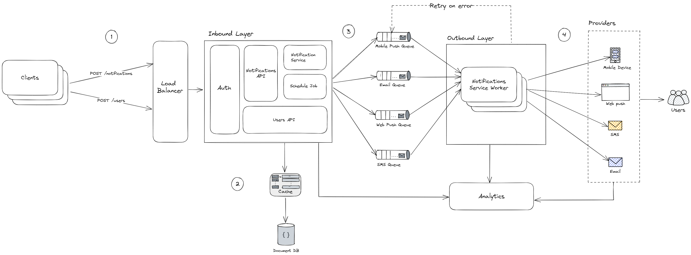
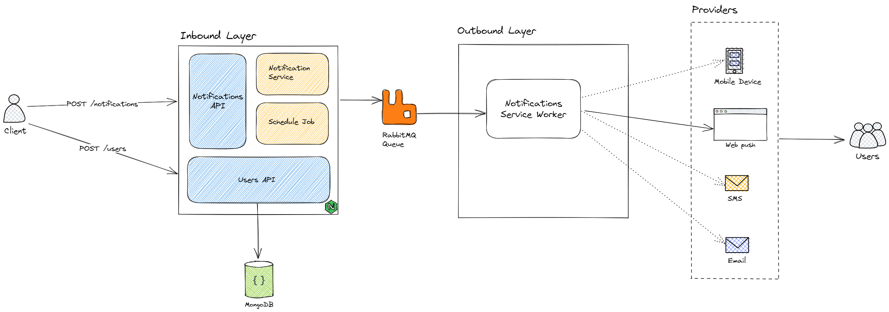
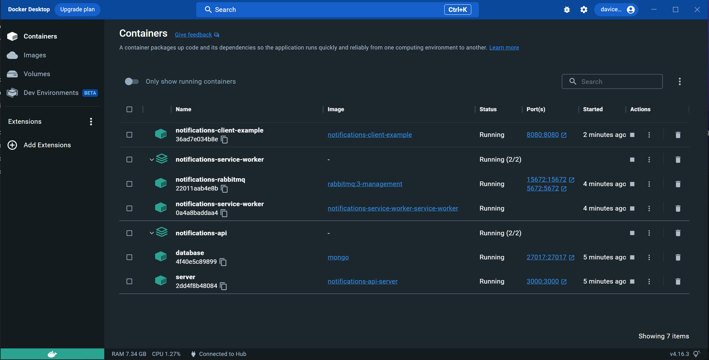
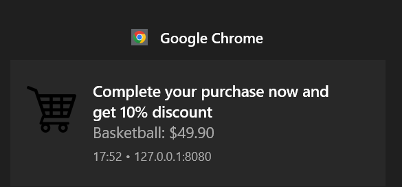

# Notifications Manager

  *A generic solution for managing notification moderation between services and clients. In addition to allowing sending to different types of channels, scheduling and controlling notification subscriptions*

## Project
This solution proposes APIs and workers for sending notifications. Due to the potential high scale sending notifications, it is not possible to deliver them in real time. So the main goal is to enable horizontally scaling the components is to ensure that users get notifications as quickly as possible. If the system is under a high workload, in the best case, notifications will be sent with a slight delay. The number of queued notifications can be used to decide when and how much services need to scale. The more notifications, the more workers are needed to read from queues and send them.

To ensure that each component has its own versionable repository, this project is divided into 2 submodules and a dummy Client to test sending notifications. Check each one out to see how to run them individually, or skip to the [Setup & Run](#Setup_&_Run) section at the bottom of the page to see how to run all components together.

- https://github.com/davicedraz/notifications-api
- https://github.com/davicedraz/notifications-service-worker
- https://github.com/davicedraz/notifications-manager/tree/master/client

## Working flow
1. A service or client calls the APIs provided to send a new notification
2. Notification Service query from the cache or database all user preferences and necessary info to send the notification
3. A notification event (or message) is sent to the corresponding queue for processing
4. Notifications Service Workers pull notification events from message queues
5. Workers send notifications to third party providers
6. Third-party providers send notifications through the chosen channel

## Design 

As we know, in a large-scale production environment, services make requests and compete for resources. To ensure scalability and resiliency, the current architectural design is based on decoupling the **Inbound layer** from **Outbound layer**. Therefore, the separation of the two layers aims to obtain a higher throughput, allowing the services in each layer to scale independently. The details of these layers, design decisions and other components are detailed below.



As the diagram shows, from left to right, it all starts with clients from different origins making requests to the system. These clients can be other services or applications that provide an interface for managing these resources. Requests can be of two types:
- Manage user information and preferences: `/users`
- Request or manage the sending of notifications: `/notifications`

### Users API

In order to notifications reach users, the devices involved in the communication channels (mobile devices, telephone lines, email addresses or browsers) must be registered and linked to a existing user. So, when a user signs up for another service, installs the application and chooses to receive notifications, the **[Notifications API](https://github.com/davicedraz/notifications-api)** receives the user's information and stores it in the database. The examples below shows the minimum required to send a Web Push. Each channel requires specific information.

#### Minimal example of a `POST:/v1/users`

```json
{
    "name": "Jhon Doe",
    "email": "email@test.com",
    "phoneNumber": "+177891343578",
    "webPushSubscription": {
        "endpoint": "https://fcm.googleapis.com/fcm/send/****",
        "keys": {
            "p256dh": "BFJAWKen0CGhacIdCRS***",
            "auth": "A9HPWGf9sTg84J****"
        }
    },
    ...
    "preferences": [
        {
            "channel": "web_push",
            "enabled": true
        },
        ...
    ]
}
```
### Load Balancer
This user and device registration can happen in several ways, by several different sources, which may need to communicate directly with the APIs. Here we can use a Load Balancer to avoid spams and distribute the workload between the different APIS instances.

#### Rate limiting
In addition to securing APIs, we can avoid overwhelming users with too many notifications by limiting the number of notifications a user can receive. This prevents recipients from opting out of notifications completely because of the annoyance

### Notifications API
The **[Notifications API](https://github.com/davicedraz/notifications-api)** is the component that centralizes receiving requests for sending notifications in the **Inbound Layer**, for N services that want to send to N different channels. When ready to be sent, the notification is queued to be sent through providers.

#### Authentication 
It is important that only authenticated clients can send notifications using the Notifications API. Each notification delivery provider requires a type of validation that can be performed here.

#### Minimal example of a `POST:/v1/notifications`

```json
{
    "userEmail": "email@test.com",
    "title": "Complete your purchase now and get 10% discount",
    "content": "Basketball: $49.90",
    "imageUrl": "https://cdn-icons-png.flaticon.com/512/34/34627.png?w=360",
    "channel": "web_push",
    "sendAfter": "2022-09-24 14:00:00 GMT-0300"
}
```
To create a notification, it is necessary to inform, at least, the `email` of a previously registered user (recipient), the `title`, `content` and the `channel` that the notification must be sent. If you don't want the notification to be sent immediately, you can schedule it by entering a `sendAfter` datetime.

#### Schedule Job
A notification created with a `sendAfter` will be saved in the database but will only be processed and placed in the send queue at the scheduled time. This happens through a Cron Job that checks every minute if, for notifications not sent in the database, it is already time to send them. Then it dispatches them and updates their `sentAt`.

#### Notification Service
This sending is done by the service that knows the different queues and sending channels. This service would interface directly with a RabbitMQ for example, which can be used as a buffer for messages that need to be sent. Many requests arrive via the API and are processed by this service, which is responsible for storing them in the database, sending logs to the Analytics service and controlling the cache.

#### Cache
An in-memory database can be used as a cache to store information that is unlikely to change such as device credentials, user information, and other frequently requested data that is needed to send notifications. In addition to improving the speed of processing notifications and increasing the scalability of APIs.

#### Document Database
The choice of a document database was basically based on:

- Schema flexibility: modeling notifications for different channels is a challenge. As the data can be stored here without the need to follow a rigid model, it is easier to change the model according to the inclusion of new channels and providers.
- Scalability and performance: A notifications API can have spikes in traffic, such as during marketing campaigns or special events. It is important that the database is also horizontally scalable. In addition, the amount of device and channel-specific information per user can be large and can grow vertically, requiring the bank to be able to handle large queries.

### Analytics
The integration between the Notification Service and the Analysis service is often essential for tracking system performance and identifying improvements. Whenever a notification is scheduled, queued, retried, or received, the analytics service can receive and store these states. Thus, important metrics such as open rate, click-through rate and engagement are possible to measure customer behavior. Some examples of third-party platforms are Amplitude, Mixpanel and Appsflyer. Or is it possible to plug-in our own service.

### Queues
Notification queuing removes dependencies between *Inbound* and *Outbound* layers. Assigning each type of notification to a different queue ensures that our delivery continues even if one of the providers of one or more channels suffers an interruption.

#### Retry on error
If a provider happens to fail to send a notification, the notification can be added back to the message queue for a retry. Thus, service workers that consume from queues and attempt to send can retry a predefined number of times. If the maximum retries are reached, the notification can go to a dead letter queue and an alert can be triggered to fix the problem.

### Workers
**[Notifications Service Workers](https://github.com/davicedraz/notifications-service-worker)** are stateless instance servers responsible only for consuming notification events from message queues and trying to send them to the corresponding providers. The biggest advantage is that they are lightweight, simple and ready to be easily scaled horizontally. When successfully forwarding the notification to the provider, the Worker can update the state of the notification in the Analytics service and make the acknowledgment of the event for the queue it consumed.

### Providers
Providers are the real ones responsible for sending notifications to users' devices. To ensure extensibility, it is important that it is easy to add or remove providers from Workers. It is good that there is redundancy in the types of services offered by providers. If one becomes unavailable, an alternative provider can be used to ensure that the notification is sent as quickly as possible.

## Proof of Concept
As a partial implementation of the project presented above, minimum viable versions of the Notifications API, Users API and Notifications Service Worker components were built and can be run together to have a demonstration of the workflow described at the beginning of the page.



## Setup & Run

To run this proof of concept, you will need [docker](https://docs.docker.com/engine/install) and [docker-compose](https://docs.docker.com.xy2401.com/v17.12/compose/install/). If you prefer to run each component individually on your own machine, see the README.md for each repository listed at the top of the page.

1. Clone the project and define an `.env` file for each of the components.

2. Create a Docker network called notifications-net by running the command:

```bash
docker network create notifications-net
```

3. Start the API and worker containers by running the following commands in separate terminal windows:
```
docker-compose -f ./notifications-api/docker-compose.yaml up
```

```
docker-compose -f ./notifications-service-worker/docker-compose.yaml up
```

4. Build the example of Client Docker image by running the command:

```
docker build -t notifications-client-example ./client
```
5. Start the client container by running the command in a separate terminal window:

```
docker run -p 8080:8080 --network notifications-net --name notifications-client-example notifications-client-example
```



## How to use it

1. Run all components manually or using Docker
2. Once all components are up and running, create a new user using the Users API.

    Tip: the APIs have a [Swagger](https://swagger.io/) that you can visit at http://localhost:3000/docs

3. Ensure that the `email` used to create the user is the same used by the dummy client [here](https://github.com/davicedraz/notifications-manager/blob/master/client/public/main.js#L1)
4. Open the client page in your browser and check if notifications permissions are enabled for the address where the client is being served
5. If everything is running as expected, you should be able to GET the user you created and verify that your `webPushSubscription` attribute has been filled in by the Client
6. Now just create a new notification using the Notifications API and see the web push notification coming. Something like this:



Final tip: you can access http://localhost:15672/ to see RabbitMQ queue and connections 😃