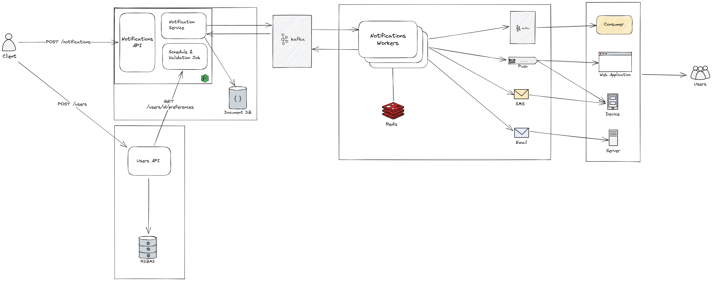

# Notifications Manager

  *A generic solution for managing, scheduling and sending notifications in order to be scalable and resilient*

## Design 



## Setup & Run

```bash
docker network create notifications-net
```
```
docker-compose -f ./notifications-api/docker-compose.yaml up
```
```
docker-compose -f ./notifications-service-worker/docker-compose.yaml up
```